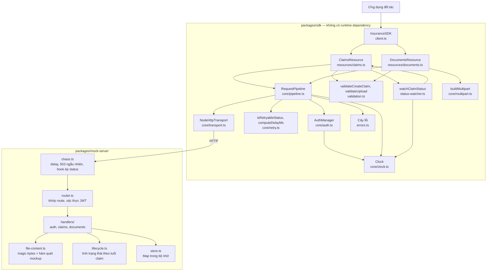

# Tổng thể các thành phần

Sequence diagram trong thư mục này mô tả thứ tự theo thời gian. Sơ đồ dưới đây bổ sung phần còn thiếu: các lớp có những gì và phụ thuộc vào nhau ra sao.

## Đọc gì từ sơ đồ này

- **Mọi request đều đi qua đúng một chỗ.** `RequestPipeline` là nơi duy nhất biết về token, retry, idempotency và map lỗi. Resource chỉ lo dựng request và kiểm tra dữ liệu, `Transport` chỉ lo gửi byte.
- **`Clock` được ba nơi dùng chung.** Nhờ inject được nó, test kiểm tra backoff và polling mà không phải chờ thật một giây nào.
- **`Transport` là ranh giới thay thế được.** Unit test cắm `FakeTransport` vào đây để dựng 503, lỗi mạng hay token hết hạn một cách chính xác.
- **Chaos nằm trước router.** Vì thế một response 503 không bao giờ để lại tác dụng phụ, và retry của client luôn an toàn.
