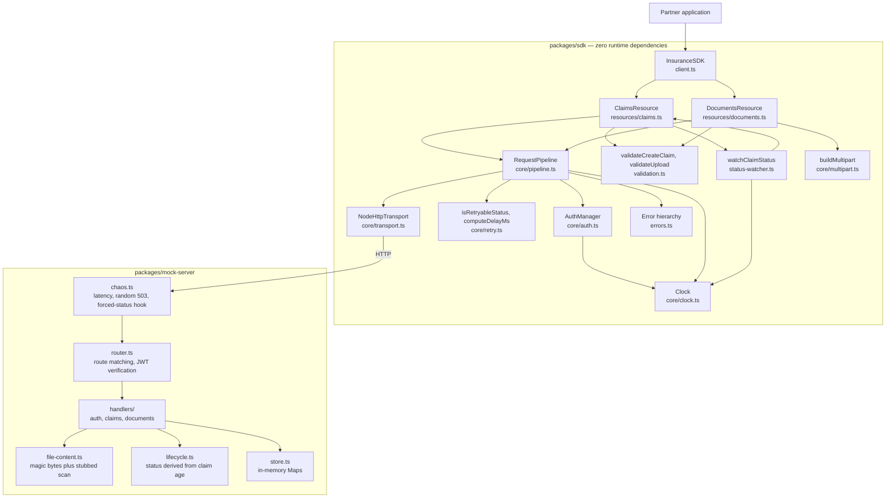

# Component overview

The sequence diagrams in this folder describe ordering in time. The diagram below fills in what they cannot show: which pieces exist and how they depend on each other.

## What to take away

- **Every request funnels through one place.** `RequestPipeline` is the only component that knows about tokens, retries, idempotency and error mapping. Resources only build requests and validate input; `Transport` only moves bytes.
- **Three components share one `Clock`.** Because it is injectable, the tests exercise backoff and polling without ever waiting a real second.
- **`Transport` is the substitution boundary.** Unit tests plug a `FakeTransport` in here to reproduce a 503, a socket failure or an expired token exactly.
- **Chaos sits in front of the router.** That is why a 503 response never leaves a side effect behind, which in turn is what makes client retries safe.
