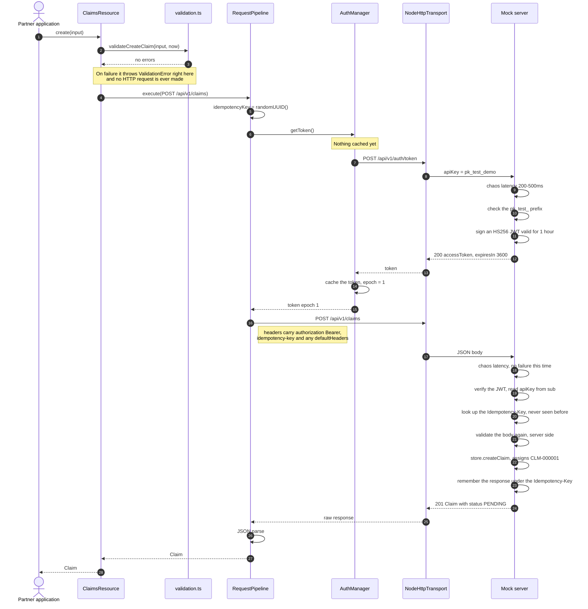

# Creating a claim — the happy path

## What to take away

- **Client validation runs before everything else.** Step 2 comes before the token is even fetched. That is why `create({})` throws without the transport being touched, and it is exactly what the tests assert with `expect(transport.requests).toHaveLength(0)`.
- **The partner never sees the token.** Steps 6 through 13 are entirely the SDK's business.
- **Validating twice is deliberate.** The client validates for instant feedback and to save a round trip; the server validates because the backend is the source of truth and must never trust what a client sends.
- **The Idempotency-Key is minted once, at step 5**, before the retry loop, so every resend carries that same key.
