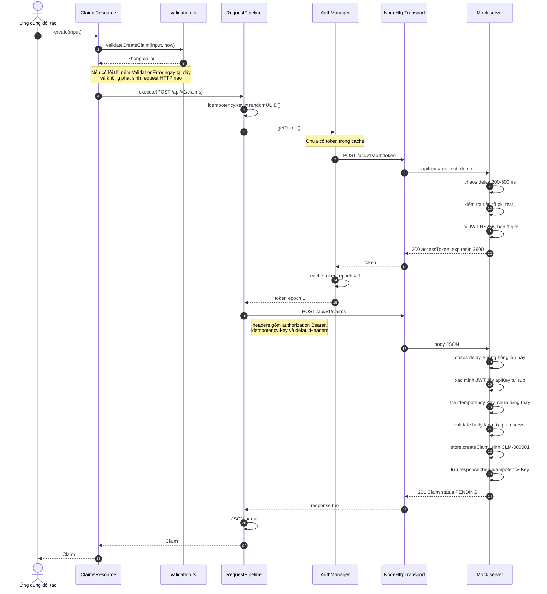

# Tạo claim — luồng thành công

## Đọc gì từ sơ đồ này

- **Validation client chạy trước tất cả.** Bước 2 đứng trước cả bước lấy token. Đây là lý do `create({})` ném lỗi mà transport không được gọi lần nào, và cũng là điều test khẳng định bằng `expect(transport.requests).toHaveLength(0)`.
- **Đối tác không phải biết gì về token.** Toàn bộ đoạn từ bước 6 đến bước 13 là do SDK tự lo.
- **Validate hai lần là cố ý.** Client validate để phản hồi tức thì và tiết kiệm một vòng mạng; server validate vì backend mới là nguồn sự thật, và không bao giờ được tin dữ liệu do client gửi lên.
- **Idempotency-Key sinh một lần ở bước 5**, trước vòng lặp thử lại, nên mọi lần gửi lại đều mang đúng key đó.
