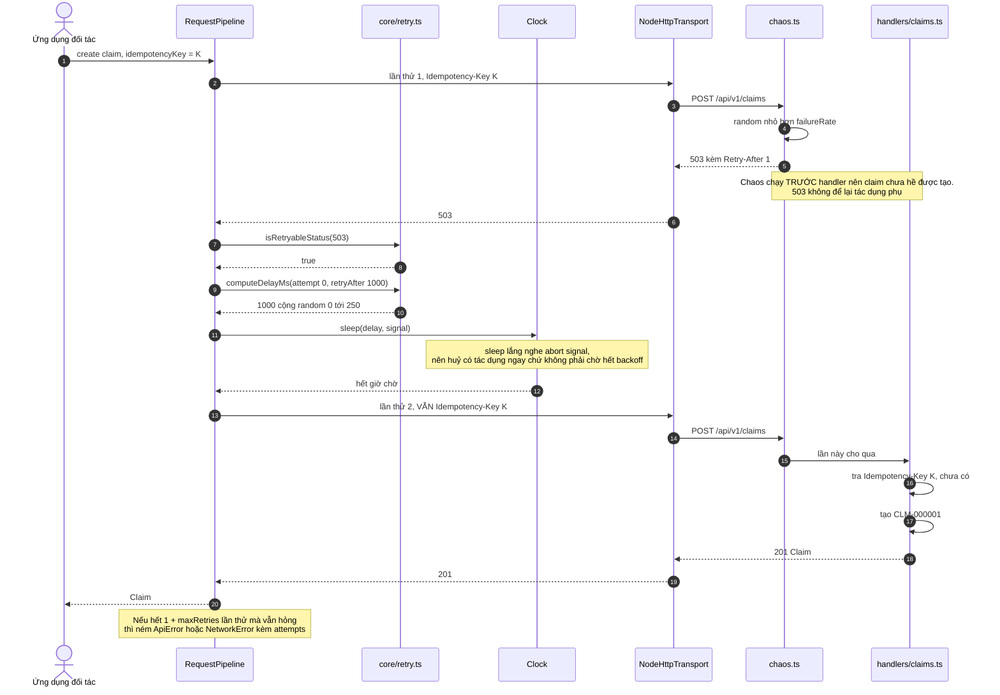

# Retry khi server trả 503

Mock server cố tình trả 503 cho khoảng 10% request. Sơ đồ này cho thấy đối tác không phải viết dòng code nào để xử lý.

## Công thức chờ

`delay = random(0, min(8000, 250 × 2^attempt))`

| Lần chờ | Trần | Khoảng thực tế |
|---|---|---|
| Sau lần thử 1 | 250ms | ngẫu nhiên 0–250ms |
| Sau lần thử 2 | 500ms | ngẫu nhiên 0–500ms |
| Sau lần thử 3 | 1000ms | ngẫu nhiên 0–1000ms |

Khi server có gửi `Retry-After`, khoảng chờ là `retryAfterMs + random(0, 250)`.

## Đọc gì từ sơ đồ này

- **Phần ngẫu nhiên mới là điểm quan trọng, không phải phần nhân đôi.** Backoff cố định khiến mọi client cùng thức dậy đúng một nhịp và dồn tải vào server đang yếu. Nhân đôi chỉ giãn khoảng cách theo thời gian, nó không phá được sự đồng pha giữa các client.
- **Cùng một `Idempotency-Key` ở bước 2 và bước 12.** Nếu lần thử đầu đã tới được handler rồi mới rớt kết nối, lần thử sau nhận lại đúng claim cũ chứ không tạo bản trùng.
- **Không phải lỗi nào cũng thử lại.** 429, 502, 503, 504, lỗi socket và timeout thì có. 400, 403, 404, 409, 413, 422 thì ném ngay vì thử lại cũng không đổi kết quả.
