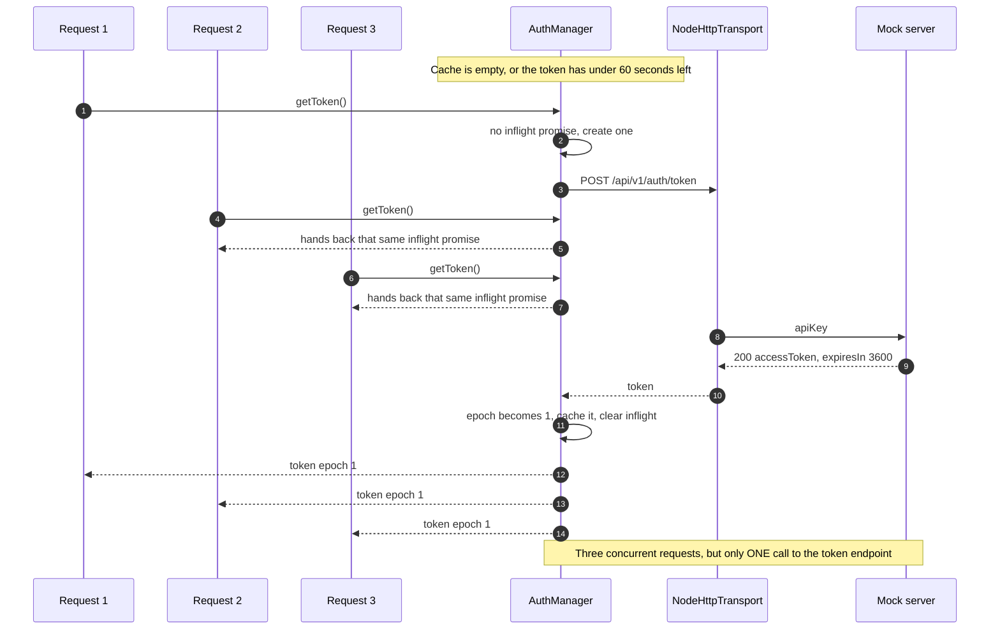
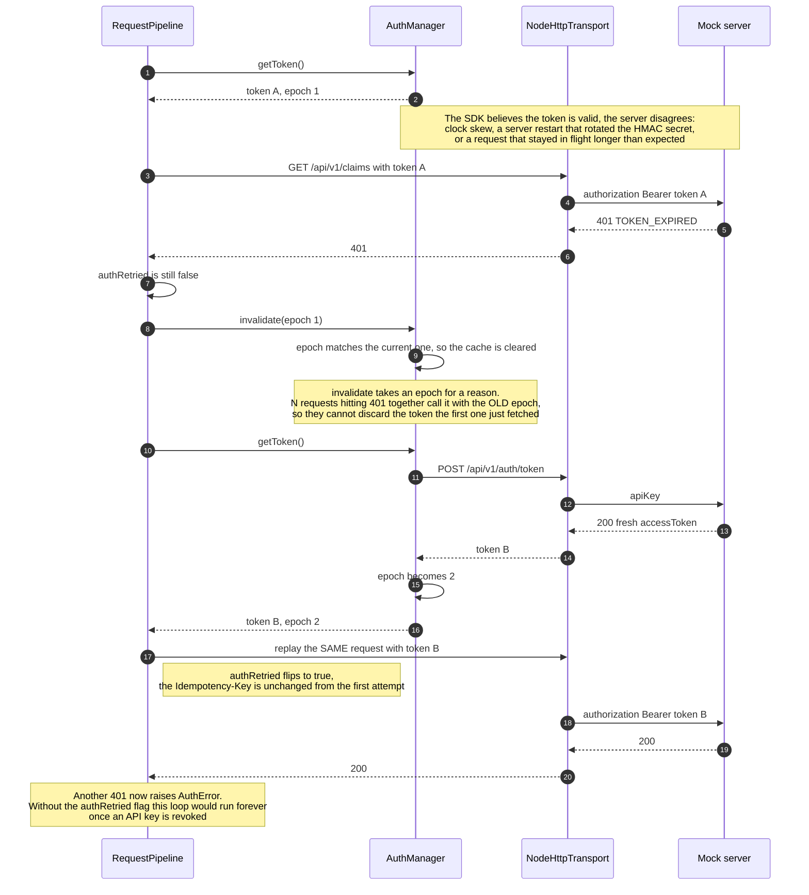

# Authentication and automatic token refresh

## Collapsing concurrent refreshes into one

## A token that expires mid-flight: reactive refresh

## What to take away

- **Proactive refresh is the first line of defence.** A token counts as expired 60 seconds before its real `exp`, so under normal conditions a nearly dead token is never sent.
- **Reactive refresh is the second line, and it is necessary.** Restarting the mock server alone rotates the HMAC secret, turning every existing token into a bad signature that the SDK has no way to anticipate.
- **The `authRetried` flag stops an infinite loop.** With a revoked API key the server returns 401 forever; without the flag the call would never return and the server would take hundreds of requests per second.
- **A bad API key behaves differently.** The server answers 401 `INVALID_API_KEY` at the token exchange itself, and the SDK raises `AuthError` immediately without retrying.
