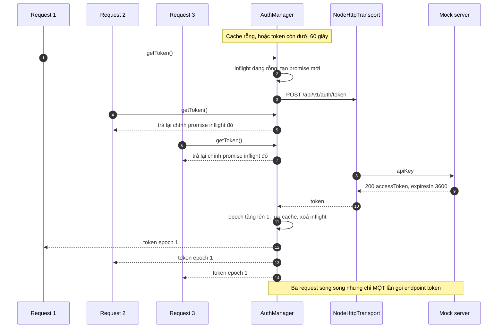
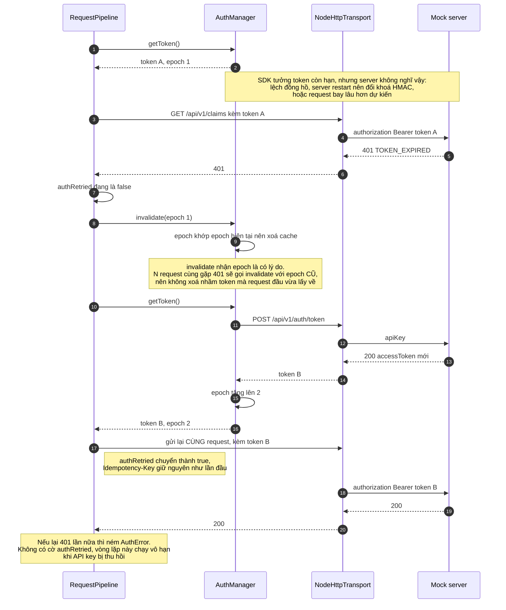

# Xác thực và tự động refresh token

## Gộp nhiều lần refresh đồng thời thành một

## Token hết hạn giữa chừng, refresh bị động

## Đọc gì từ sơ đồ này

- **Refresh chủ động là tuyến phòng thủ thứ nhất.** Token bị coi là hết hạn sớm hơn 60 giây so với `exp` thật, nên bình thường chẳng bao giờ gửi đi token sắp chết.
- **Refresh bị động là tuyến thứ hai, và nó cần thiết.** Riêng việc mock server restart là đã sinh khoá HMAC mới, làm mọi token cũ thành chữ ký sai mà SDK không có cách nào biết trước.
- **Cờ `authRetried` chặn vòng lặp vô hạn.** Khi API key bị thu hồi và server luôn trả 401, không có cờ này thì lời gọi không bao giờ trả về còn server nhận hàng trăm request mỗi giây.
- **Sai API key thì khác hẳn.** Server trả 401 `INVALID_API_KEY` ngay ở bước đổi token, SDK ném `AuthError` luôn và không thử lại.
