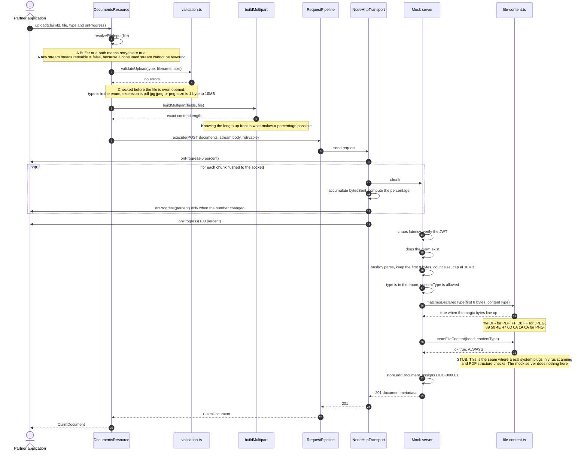

# Uploading a document with progress

## What to take away

- **Three rules govern progress:** always emit 0% at the start and 100% at the end, never emit the same percentage twice, and restart from 0 when a request is retried.
- **Progress counts bytes flushed to the socket**, taken from the `req.write` callback, not bytes read from the file. Backpressure makes those two numbers diverge.
- **`retryable` is decided at step 2**, from the shape of the file input. For a raw stream the SDK would rather report an honest error than silently upload a truncated file.
- **The two server-side file checks are fundamentally different.** `matchesDeclaredType` is a real check and defeats the rename trick. `scanFileContent` is a stub that always passes, present only to mark the seam for a real system. See "Server-side file validation" in the README.
