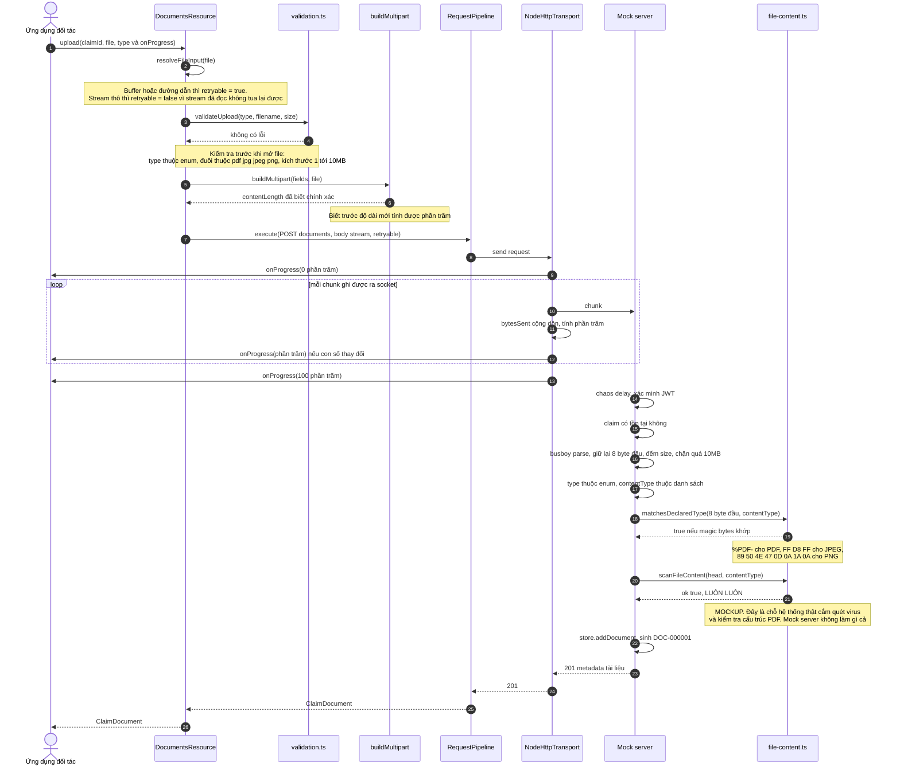

# Upload tài liệu kèm tiến độ

## Đọc gì từ sơ đồ này

- **Ba quy tắc của progress:** luôn phát 0% lúc bắt đầu và 100% khi xong, không phát trùng một con số phần trăm, và nếu request bị thử lại thì quay về 0 cho lần thử mới.
- **Progress đo theo byte đã ghi ra socket**, lấy từ callback của `req.write`, chứ không phải byte đã đọc từ file. Có backpressure nên hai con số này lệch nhau.
- **`retryable` được quyết định từ bước 2**, dựa trên nguồn file. Với stream thô, SDK thà báo lỗi trung thực còn hơn âm thầm gửi lên một file bị cụt.
- **Hai tầng kiểm tra file ở server có tính chất khác hẳn nhau.** `matchesDeclaredType` là kiểm tra thật và chặn được trò đổi tên file. `scanFileContent` là hàm giả luôn cho qua, tồn tại để lộ ra chỗ cắm cho hệ thống thật. Chi tiết ở mục "Kiểm tra file phía server" trong README.
