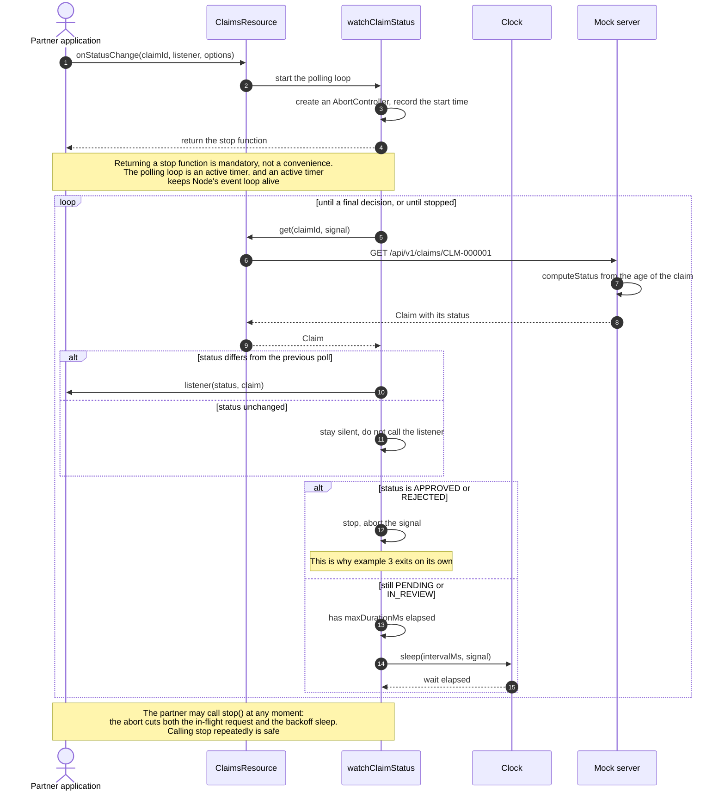

# Tracking claim status

## Three layers of protection against a leaked loop

| Layer | Triggered by | Effect |
|---|---|---|
| The `stop()` function | The partner calling it | Clears the timer, aborts the pending request |
| Self-stop on a terminal status | The claim reaching `APPROVED` or `REJECTED` | The loop exits and the script can finish |
| `maxDurationMs` | 5 minutes by default | Stops even when the status is stuck because of a server fault |

## What to take away

- **The listener fires only on a real change.** Polling every 2 seconds while the claim sits at `PENDING` calls the listener zero times.
- **The first poll only establishes a baseline**, unless that status is already terminal. Pass `initialStatus` from the claim you just created and the very first poll can report a change.
- **It uses a recursive `setTimeout`, not `setInterval`.** The server adds 200–500ms of latency and fails 10% of calls with a retry, so `setInterval` would let two polls overlap.
- **Polling errors go to `onError`**, without breaking the loop and without producing an unhandled rejection.
