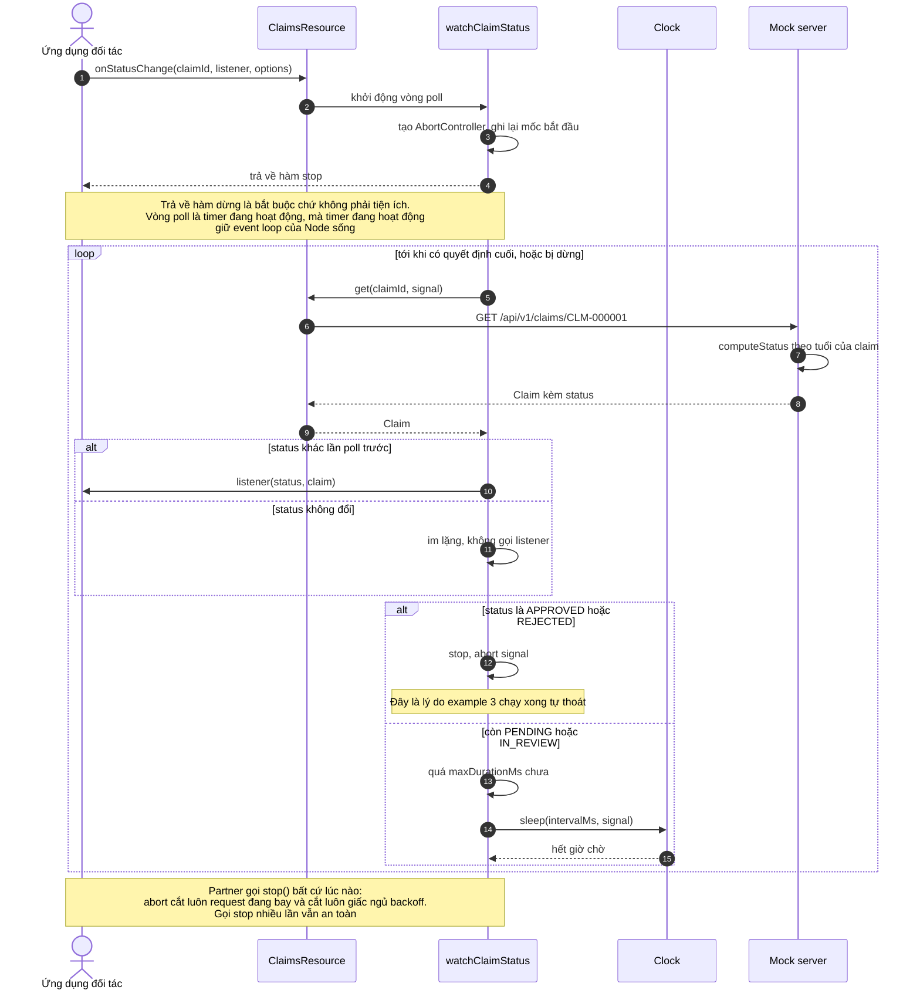

# Theo dõi trạng thái claim

## Ba lớp bảo vệ chống rò rỉ vòng poll

| Lớp | Kích hoạt khi | Kết quả |
|---|---|---|
| Hàm `stop()` | Đối tác chủ động gọi | Clear timer, abort request đang chờ |
| Tự dừng ở trạng thái cuối | Claim vào `APPROVED` hoặc `REJECTED` | Vòng lặp thoát, script kết thúc được |
| `maxDurationMs` | Mặc định sau 5 phút | Dừng cả khi trạng thái bị kẹt vì server lỗi |

## Đọc gì từ sơ đồ này

- **Chỉ phát khi trạng thái thật sự đổi.** Poll mỗi 2 giây nhưng claim đứng yên ở `PENDING` thì listener không bị gọi lần nào.
- **Lần poll đầu tiên chỉ để lấy mốc so sánh**, trừ khi trạng thái đó đã là trạng thái cuối. Truyền `initialStatus` từ claim vừa tạo thì nghe được thay đổi ngay từ lần poll đầu.
- **Dùng `setTimeout` đệ quy chứ không `setInterval`.** Server có delay 200–500ms và 10% trả 503 kèm retry, nên nếu dùng `setInterval` thì hai lần poll có thể chồng lên nhau.
- **Lỗi khi poll đi vào `onError`**, không làm vỡ vòng lặp và không tạo unhandled rejection.
